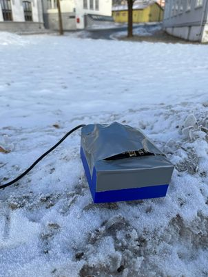
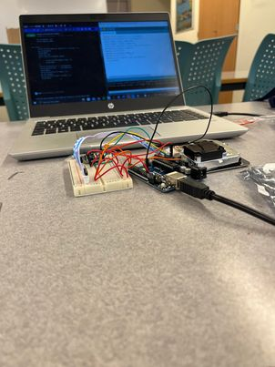

# weathermeter.ino
Arduino unit measuring temperature, humidity, altiude, particle pollution of both smaller and bigger particles.

## Modules and items used:
* [Arduino Uno](https://store.arduino.cc/products/arduino-uno-rev3-smd)
* [Adafruit BMP280](https://www.adafruit.com/product/2651)
* [SDS011](https://aqicn.org/sensor/sds011/)

3D model of the housing of the project was done with Sketchup, a free tool for basic 3D modeling. The model was realized with the help of my school 3D printer

This project was completed in March 2022

